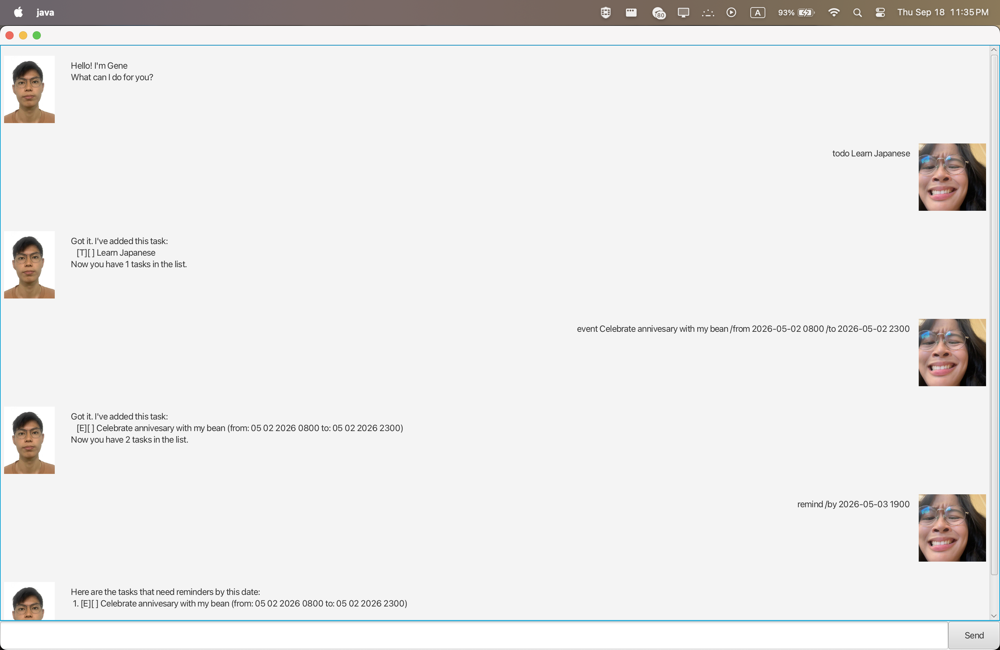

# Gene User Guide

## Product Screenshot



---

## Introduction

Gene is a chatbot that helps users manage their tasks and deadlines efficiently. It is ideal for users who want to stay
organized and on top of their work, especially those familiar with CLI usage for quick access.

- [Quick Start](#quick-start)
- [Features](#features)
    - [Add](#adding-a--task)
    - [Delete](#features-summary)
    - [Mark/Unmark](#markingunmarking-a-task)
    - [List](#listing-the-tasks)
    - [Remind](#remind-tasks)
    - [Exit](#exiting-the-program)
- [Command Summary](#commands-summary)

---

### Quick Start

Ensure you have Java 17 or above installed in your Computer.
Mac users: Ensure you have the precise JDK version prescribed here.

Download the latest .jar file from here.

Copy the file to the folder you want to use as the home folder for your chatbot.

Open a command terminal, cd into the folder you put the jar file in, and use the java -jar gene.jar command to
run the application.

A GUI similar to the below should appear in a few seconds.

---

### Features

Notes about command format:

- Words in <> are parameters to be supplied by the user
- Parameters must be in order
- Date must be given in the format ```YYYY-MM-DD HHmm``` (e.g. 2024-06-30 1800)

Introduction to Tasks:

- There are 3 types of tasks: Todo, Deadline, Event
- Todo a normal task without any date/time attached to it
- Deadline A task that needs to be done by a specific date/time
- Event A task that starts at a specific date/time and ends at a specific date/time

All tasks have a description and a status indicating whether it is done or not.

### Adding a  Task.

1. Todo task: ```todo <task description>```

- Example: ```todo read book```

2. Deadline task: ```deadline <task description> /by <deadline>```

- Example: ```deadline submit report /by 2026-06-30 1800```

3. Event task: ```event <task description> /from <start> /to <end>```

- Example: ```event project meeting /from 2026-06-30 1800 /to 2026-06-30 1900```

### Marking/Unmarking a Task

Used when you have completed the task/uncompleted the task.
Mark a task as done: ```mark <task number>```
Example: ```mark 1```

### Listing the Tasks

List all tasks in the task list: ```list```

### Remind Tasks

Shows all tasks due/happening before a specified date: ```remind /by <date>```

### Exiting the Program

Either by command ```bye``` or by closing the GUI with the X button on top left of screen

### Saving the Data

All data is saved automatically in the file ```data/gene.txt``` in the same folder as the jar file.

When program restarts, data is loaded from the file.

---

## Commands Summary

| Feature      | Command Format                                     | Example Usage                             |
|--------------|----------------------------------------------------|-------------------------------------------|
| Add Todo     | `todo <task description>`                          | `todo read book`                          |
| Add Deadline | `deadline <task description> /by <deadline>`       | `deadline submit report /by 2024-06-30`   |
| Add Event    | `event <task description> /from <start> /to <end>` | `event project meeting /from 2pm /to 4pm` |
| Delete Task  | `delete <task number>`                             | `delete 2`                                |
| Mark as Done | `mark <task number>`                               | `mark 1`                                  |
| Unmark Task  | `unmark <task number>`                             | `unmark 1`                                |
| List Tasks   | `list`                                             | `list`                                    |
| Remind Tasks | `remind /by <date>`                                | `remind 2024-06-30`                       |
| Exit Program | `bye`                                              | `bye`                                     |

---


